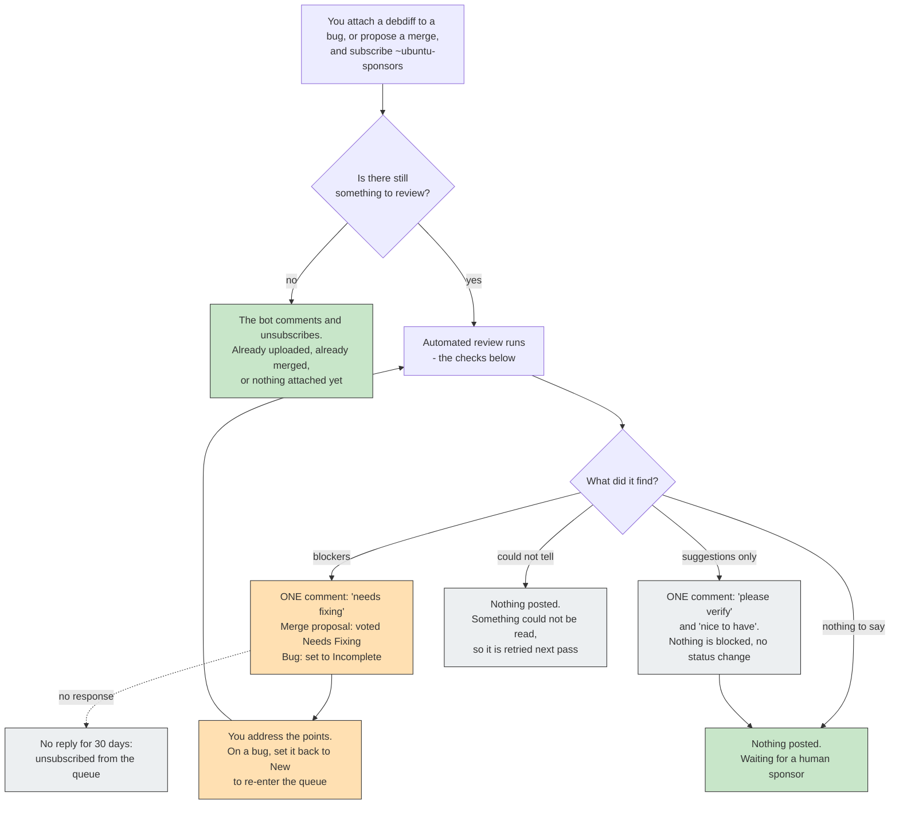

# Checks reference

What Frontdesk looks for, what it will say to you, and what it does to your
bug or merge proposal. This is the contributor-facing list: if the bot
commented on something you filed, the wording it used is quoted below, and
you can see exactly which check produced it.

It is also where the wording itself gets reviewed, so if a comment reads
badly, this page is the place to propose better words -- the text here is
the text that gets posted.

`doc/GLOSSARY.md` defines the vocabulary and `doc/design_journal.md` carries
the rationale behind each check (the design entry numbers below).

## What happens to your submission

Three things that surprise people:

- **A bot comment is not a rejection.** Even a blocking one is a request for
  a change, and the item comes straight back into the queue once addressed.
- **An Incomplete bug needs setting back to New.** That is what re-enters it
  into the sponsoring queue; the bot says so in its comment.
- **Silence usually means it is queued for a human.** The bot only comments
  when it has something to say, and it deliberately stays quiet once a human
  reviewer is involved.

This is the contributor's view. For the bot's own control flow -- the order
checks run in, what short-circuits what -- see `doc/flow.dot` and the
rendered `doc/flow.svg`.

## How a pass ends

Every check returns one of three tiers, and the tier decides the action:

- **closing** -- the item is already resolved. The check posts its own
  comment, unsubscribes `~ubuntu-sponsors`, and the pass ends there.
  Anything found earlier in the pass is deliberately discarded: telling you
  about changelog style on a request that's already uploaded is noise.
- **incomplete** -- a blocker. All blockers found in one pass are merged
  into a *single* comment, under a "Needs fixing before this can be
  sponsored" heading. On a merge proposal that comment carries a
  `Needs Fixing` vote; on a bug the matching tasks are set **Incomplete**
  (only the tasks the reviewed change actually targets, not sibling series)
  and `~ubuntu-sponsors` stays subscribed. Set the bug back to New once
  you've addressed the points and it re-enters the queue.
- **question** -- non-blocking. Appears in the same comment under either
  "Please verify" (`kind="verify"`: if real it would need fixing, but the
  check isn't confident enough to block) or "Nice to have"
  (`kind="advisory"`). No vote, no status change.

So a contributor sees at most one comment per pass. The intro, the section
headings and the closing line come from `render_findings_comment`
(`checks.py:57`); the quoted wording below is the bullet each check
contributes.

Two cases close without a status write: Check 4 and the "already uploaded"
branch of Check 6 comment and leave the MP open, because git-ubuntu merge
proposals reject status writes from the bot (a human closes them out).

## The checks

| # | Check | Scope | What it detects | What the bot does |
|---|---|---|---|---|
| 1 | [Administrative state](#check-1-administrative-state) | MP + bug | Every relevant Ubuntu task is already closed and something landed, or the MP is Merged. A still-live linked MP blocks closing. | closing: comments and unsubscribes. A fully Fix Released item closes **silently**. |
| 1b | [Nothing to sponsor](#check-1b-nothing-to-sponsor) | bug | No patch and no linked MP; or every open series is already covered by a linked MP's review; or a needs-packaging bug is already published or queued. | closing: comments (one of three wordings) and unsubscribes. |
| 2 | [Target branch](#check-2-target-branch) | MP | A merge MP targeting `ubuntu/devel` instead of `debian/*`; an SRU-shaped MP targeting the wrong series branch; a release-pocket branch that is behind what's published. | incomplete, **except** advisory when a release-pocket branch isn't actually behind. Firing here suppresses Check 3. |
| 3 | [Merge conflicts](#check-3-merge-conflicts) | MP | The branch cannot be merged cleanly into its target. | incomplete. Skipped entirely when Check 2 fired, since a wrong target branch is usually the cause. |
| 4 | [Empty diff](#check-4-empty-diff) | MP | The preview diff is empty: the change already landed in the target. | closing: comments, no status write. |
| 5 | [Changelog bug reference](#check-5-changelog-bug-reference) | MP + bug | The changelog cites `LP: #N` for a bug not reported against this source package. | incomplete; question/verify when the bug cited is the one the debdiff is attached to. |
| 6 | [Version vs. the archive](#check-6-version-vs-the-archive) | MP + bug | The proposed version against everything published for the target series: already uploaded, same version with different content, older than the archive, or waiting in the upload queue. | Varies: closing when already uploaded; incomplete for a collision or a stale version; or defers the item silently (waiting for the archive importer, or for the upload queue). The only check that notifies the operator. A bounce here skips Check 13. |
| 7 | [Newer series first](#check-7-newer-series-first) | MP + bug | An SRU with no evidence the fix landed in the development release or newer supported series. Evidence can be a task status, a linked MP, a patch attachment, or the bug text. | question / verify. Runs late in the pass because it can spend an LLM call. |
| 8 | [Direct source edit](#check-8-direct-source-edit) | MP + bug | Files outside `debian/` edited directly instead of via `debian/patches`. Merges, new upstream versions and native packages are exempt. | incomplete. |
| 9 | [Missing changelog entry](#check-9-missing-changelog-entry) | MP | The diff adds no `debian/changelog` entry. | incomplete. |
| 10 | [Plain patch, not a debdiff](#check-10-plain-patch-not-a-debdiff) | bug | The attached patch touches no `debian/` file, so it isn't sponsorable as-is. | incomplete. |
| 11 | [PPA version suffix](#check-11-ppa-version-suffix) | MP + bug | The proposed version carries a `~ppaN` suffix. | incomplete. |
| 12 | [XSBC-Original-Maintainer](#check-12-xsbc-original-maintainer) | MP + bug | A package's first Ubuntu delta whose `debian/control` doesn't preserve the Debian maintainer. | question / advisory. |
| 13 | [SRU version convention](#check-13-sru-version-convention) | MP + bug | The SRU version string doesn't follow the recommended convention. Delegates to `ubuntu-lint`; silently skipped when `python3-ubuntu-lint` isn't installed. | question / advisory. Skipped when Check 6 already bounced the version. |
| 14 | [SRU version precedence](#check-14-sru-version-precedence) | MP + bug | A newer series publishing a *lower* version (so the fix hasn't landed there yet), or a proposed version already used somewhere in archive history. | incomplete. |
| 15 | [No-change rebuild version](#check-15-no-change-rebuild-version) | MP + bug | A no-change rebuild (only `debian/changelog`, plus `update-maintainer`'s `debian/control` lines) using an `ubuntuN` instead of a `buildN` revision. | incomplete. |
| 16 | [DEP-3 patch header](#check-16-dep-3-patch-header) | MP + bug | A newly added `debian/patches/` patch with no DEP-3 header (no `Description:`/`Subject:`). Merges skipped; modified patches not judged. | incomplete. |

## What the bot posts

Placeholders in braces are filled in from the item being reviewed.

### Check 1: administrative state

`check_administrative_state`, design #1/#112/#126. Only the Fix Committed
branch comments; an item where every task is Fix Released is closed without
a word.

> This request has been uploaded and is awaiting release, so there is
> nothing left for a sponsor to do here. Cleaning up the queue by
> unsubscribing ~ubuntu-sponsors.

### Check 1b: nothing to sponsor

`check_nothing_to_sponsor`, design #68/#75. Three wordings. When the work is
being reviewed on linked merge proposals:

> The fix proposed here is being reviewed on the merge proposal{plural}
> linked to this bug, so there is no need for a separate sponsoring-queue
> entry for the bug itself. Cleaning up the queue by unsubscribing
> ~ubuntu-sponsors; the review continues on the merge proposal{plural}.

When there's nothing attached at all:

> There doesn't seem to be a patch or merge proposal attached to this bug
> yet, so there is nothing for the sponsors team to review at this point.
> Cleaning up the queue by unsubscribing ~ubuntu-sponsors -- please
> subscribe them again once a proposed fix is available.

When a needs-packaging bug is already published or sitting in the queue:

> {note}, so there is nothing left for a sponsor to do here. Cleaning up
> the queue by unsubscribing ~ubuntu-sponsors; should the upload be
> rejected, please subscribe ~ubuntu-sponsors again to get back in the
> review queue.

### Check 2: target branch

`check_target_branch`, design #4/#128. A merge MP pointed at the wrong
branch:

> This Merge Proposal is a merge (rebase onto a newer Debian revision) but
> targets `ubuntu/devel`. According to our workflow, merge MPs should target
> {target_phrase} instead (workaround for LP: #1976112). Please update the
> target branch.

An SRU-shaped MP whose changelog and target branch disagree:

> This Merge Proposal's changelog entry targets `{suite}`, but the MP itself
> targets `{target_branch_name}` instead of `{expected}`. Please update the
> target branch to match the series you're fixing -- this is very likely
> also the cause of any reported merge conflicts, since the branch is being
> compared against the wrong history.

A release-pocket branch that is genuinely behind (blocking); when it isn't
behind, the same recommendation is posted as a non-blocking advisory
instead:

> The branch this Merge Proposal targets (`{target_branch_name}`) is behind:
> it carries `{release}` while `{newest}` is already published, so this
> change would be based on outdated content. Please target `{expected}`
> instead -- it includes any SRUs already in `-updates` (and anything staged
> in `-proposed`) -- and rebase on it.

### Check 3: merge conflicts

`check_mp_conflicts`, design #5.

> This Merge Proposal has merge conflicts and cannot be cleanly merged.
> Please rebase your branch, resolve the conflicts, and push the updated
> branch.

### Check 4: empty diff

`check_empty_diff`, design #25.

> Thanks for your contribution! The proposed change seems to have landed in
> the target Vcs, so the merge request can be closed.

### Check 5: changelog bug reference

`check_changelog_bug_reference`, design #40.

> The bug reference(s) in {where} ({bug_list}) don't appear to be reported
> against `{package}`. Please double-check the bug number(s) are correct.

When the cited bug is the one the debdiff is attached to, the number can't
be a typo: the bug's task is on another package name, or the debdiff is for
the wrong package. Asked, not blocked (design #149, bug #2009138):

> {filed}, but the attached debdiff is for `{package}`, so uploading it
> won't close the bug automatically. If the debdiff is for the right
> package, the task needs moving to `{package}` (a sponsor can do this when
> uploading).

`{filed}` is "This bug's Ubuntu task is filed against `{name}`", or "This
bug has no Ubuntu task".

### Check 6: version vs. the archive

`check_stale_version`, design #12/#122. Already uploaded, so the MP can be
closed:

> Thanks for your contribution! This change was already uploaded to the
> archive as `{package} {version}` ({url}), so this merge proposal can be
> closed.

The same situation on a bug:

> Thanks for your contribution! It seems that this change was already
> uploaded to the archive as `{package} {version}`, so there is nothing left
> to sponsor here. Cleaning up the queue by unsubscribing ~ubuntu-sponsors.

Proposed version older than what's published:

> The proposed version (`{proposed_version}`) is older than the one already
> in the archive (`{archive_version}` in {target_series}). Please rebase on
> top of the current archive version.

Same version, different content -- in the archive:

> An upload with the same version (`{version}`) but different content
> already exists in the archive. Your change needs to be rebased (with a new
> version number) and resubmitted.

...or still in the upload queue:

> An upload with the same version (`{proposed_version}`) but different
> content is already waiting in the {target_series} upload queue. Your
> change needs to be rebased (with a new version number) and resubmitted.

### Check 7: newer series first

`check_sru_newer_series`, design #58/#115/#118/#134.

> SRU policy requires the fix to land in newer supported series first, and
> there is no evidence of it being resolved in {series_words}. Please check:
> if it isn't fixed there yet, {those series need / that series needs} to be
> updated before this SRU can be sponsored; if it is, please reflect that
> explicitly in the bug description or the bug status.

### Check 8: direct source edit

`check_direct_source_edit`, design #60/#62. The opening words vary ("The
changes edit" for an MP, "The attached debdiff edits" for a bug).

> {intro} upstream source files directly ({shown}{more}). Changes to
> upstream code must be provided as patches under `debian/patches` instead,
> so they stay visible and survive new upstream versions

### Check 9: missing changelog entry

`check_missing_changelog_stanza`, design #61.

> The merge proposal doesn't add a `debian/changelog` entry describing the
> changes. Please add a new changelog entry with an incremented version
> number{lp_clause}

### Check 10: plain patch, not a debdiff

`check_patch_not_debdiff`, design #63.

> The attachment is a plain code patch. Thank you for working on a fix! To
> be ready for sponsoring it needs to be turned into a source package update
> (debdiff): include the patch under `debian/patches` and add a new
> `debian/changelog` entry with an incremented version number describing the
> change

### Check 11: PPA version suffix

`check_ppa_version_suffix`, design #90.

> The proposed version (`{proposed_version}`) has a `~ppaN` suffix, which
> belongs to a PPA build, not an archive upload. Please drop it and use a
> normal archive version string

### Check 12: XSBC-Original-Maintainer

`check_xsbc_original_maintainer`, design #93.

> This looks like the package's first Ubuntu delta, but `debian/control`
> doesn't add an `XSBC-Original-Maintainer` field preserving the Debian
> maintainer

...followed by: "Please add it if you can; otherwise a sponsor can do it
before upload."

### Check 13: SRU version convention

`check_sru_version_suffix_convention`, design #109/#119/#122/#129. The
reason comes from `ubuntu-lint`.

> The proposed version doesn't follow Ubuntu's recommended SRU
> version-string convention: {reason}. This isn't necessarily wrong (what
> actually matters is that the version sorts ahead of the archive and
> doesn't collide with anything), but following the convention avoids
> surprises

### Check 14: SRU version precedence

`check_sru_version_newer_series_precedence`, design #110/#116/#117/#124. Up
to two parts, each with its own bullet list of findings:

> The fix doesn't appear to have landed in a newer series yet, which SRU
> policy requires before it can land here:

> The proposed version can't be used:
> {bullets}
> Please pick a different version.

### Check 15: no-change rebuild version

`check_no_change_rebuild_version`, design #132.

> This is a no-change rebuild, so the version should be `{expected}`, not
> `{proposed_version}`: an `ubuntuN` revision declares an Ubuntu delta that
> later merges would try to preserve.

### Check 16: DEP-3 patch header

`check_dep3_patch_header`, design #151.

> The new {noun} {names} {verb} no DEP-3 header. Please add one describing
> the change: at least `Description:`, plus `Origin:` (or `Author:`),
> `Bug-Ubuntu:` and `Forwarded:` where they apply. See {url}

`{noun}`/`{verb}` read "patch ... has" or "patches ... have"; `{url}` is
https://ubuntu.com/project/docs/how-ubuntu-is-made/concepts/patches/

## LLM-assisted reviews

These live in `llm_reviewer.py` and ask a model to judge free text a regex
can't: whether a description is actually meaningful, not whether it matches
a pattern. They run after the deterministic checks and only when the item
looks relevant. If the model is unavailable or its answer can't be parsed,
they fail safe: nothing is posted and the item is left for a human.

The prompts embed contributor-written text, so they run under a tool-less
opencode agent and a reply containing any tool use is discarded outright
(design #99).

| Review | Scope | What it judges | What the bot does |
|---|---|---|---|
| [SRU template](#sru-template) | bug + MP | Whether an SRU bug description really follows the SRU template (not just that headings exist). | incomplete. On an MP it short-circuits the rest of the MP review. |
| [Changelog stanza quality](#changelog-stanza-quality) | MP | Whether the changelog entry describes the change usefully. | question / advisory. |
| [Changelog vs. diff](#changelog-vs-diff) | MP | Whether the changelog matches what the diff actually does. | question / verify. |
| [Feature Freeze](#feature-freeze) | MP | Whether the change adds a feature while Feature Freeze is in effect. Silent when an FFe bug is already linked. | question / verify. |
| [Sync requests](#sync-requests) | bug | Whether a sync request is already satisfied, needs more justification, or should go to a human. | closing (Fix Released), incomplete, or hand over to a human. |
| Fixed in a newer series | bug | Whether the bug text shows the fix already landed in a newer series. | No comment of its own: it suppresses Check 7. |
| Already covered by a reviewer | MP + bug | Whether a human reviewer's comments already make the same points. | No comment of its own: it drops findings that would repeat the reviewer. |

### SRU template

> This looks like an SRU, but the bug description doesn't follow the
> official SRU bug template ({template_link}). {feedback}

With several linked bugs:

> This looks like an SRU with multiple linked bugs, but the following don't
> follow the official SRU bug template ({template_link}):

### Changelog stanza quality

Whether the changelog entry actually tells a reader what changed. The
wording is written by the model rather than templated here, and is posted as
a "nice to have" bullet in the aggregated comment.

### Changelog vs. diff

Where the changelog claims something the diff doesn't do, or the diff does
something the changelog doesn't mention. Also model-written, posted as a
"please verify" bullet, since a mismatch is a judgement call.

### Feature Freeze

> This change appears to introduce a new feature, and Feature Freeze is in
> effect -- please confirm there's an approved Feature Freeze Exception

### Sync requests

Already in Ubuntu, so the request is closed as Fix Released:

> Thanks for your contribution! It looks like {pkg} {req_version} (or
> newer) is already published in Ubuntu. Closing this sync request as Fix
> Released.

Needs more from the requester:

> This sync request needs a bit more work before it can be sponsored:

## Why the bot sometimes says nothing

Silence is usually deliberate. In rough order of when it happens:

- **`~ubuntu-sponsors` isn't subscribed.** The team subscription is what
  puts an item in the queue; without it the bot doesn't act.
- **The item is private.** Skipped without a comment.
- **Kernel-team packages** (#136). An item whose source package is `linux`
  or anything derived from it (`linux-signed*`, `linux-hwe-*`, `linux-oem-*`,
  per-cloud and flavour kernels, `linux-firmware`, ...) is skipped before any
  check runs: the kernel team has its own SRU and upload workflow. DKMS
  drivers such as `backport-iwlwifi-dkms` are *not* kernel packages here and
  are triaged normally.
- **The merge proposal isn't about an Ubuntu source package** (#139). The
  sponsoring report lists a proposal whenever any uploading team is a
  requested reviewer, which in September 2026 briefly pulled in two decades
  of abandoned proposals on upstream *projects*. Those have no `debian/`
  directory, so the bot has nothing true to say about them and skips before
  any check runs.
- **A brand-new bug** gets a ten-minute grace period, so a contributor can
  finish attaching things before being reviewed.
- **Nothing changed** since the last pass. The bot remembers the facts it
  acted on and won't repeat itself.
- **A lookup was inconclusive.** If Launchpad or the archive couldn't be
  read, the pass persists nothing and the item is retried later, rather than
  acting on a guess. Since #138 the audit trail names the check whose lookup
  failed, so `stats.py` can tell a real failure from a healthy skip -- each
  of these reasons records its own outcome rather than one catch-all.
- **A human reviewer is already engaged** (#94/#106). Non-blocking
  question-tier findings are dropped entirely -- a reviewer in the
  conversation doesn't need the bot's suggestions -- while real blockers are
  still posted.
- **A reviewer already said it.** Findings a human has already covered in
  their comments are dropped rather than restated.
- **Dry-run mode.** Nothing is ever written; intended writes are logged.

## Operator notifications

Separate from anything a contributor sees, the bot pings its operator over a
Mattermost webhook (`notify.py`, disabled in dry-run) when a situation needs
a human's attention rather than a contributor's: a preview diff Launchpad
never generated, the five archive-importer and rich-history cases in Check 6
(including an upload to `debian/*` that won't autoclose its MP), and
exhaustion of a run's LLM call budget.
